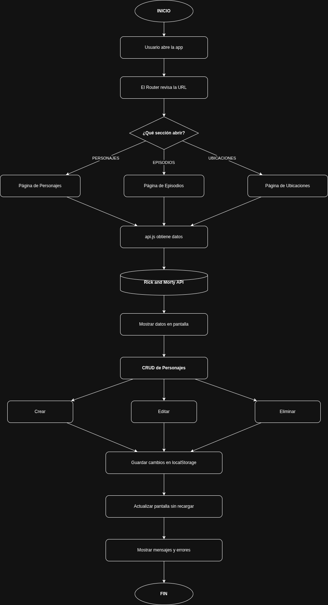

#  Rick & Morty SPA — Vanilla JS

> Taller Práctico — Evolución de una SPA | RIWI · Interdimensional Frontend Labs

Una Single Page Application (SPA) construida en **JavaScript Vanilla puro** que consume la [API pública de Rick and Morty](https://rickandmortyapi.com/) y permite explorar personajes, episodios y ubicaciones del universo, con operaciones CRUD completas sobre personajes.

---

##  Tabla de Contenidos

- [Características](#características)
- [Arquitectura](#arquitectura)
- [Estructura del Proyecto](#estructura-del-proyecto)
- [Cómo Ejecutar](#cómo-ejecutar)
- [Funcionalidades Detalladas](#funcionalidades-detalladas)
- [Decisiones Arquitectónicas](#decisiones-arquitectónicas)
- [Flujo de Datos](#flujo-de-datos)
- [Manejo de Estado](#manejo-de-estado)

---

##  Características

| Requerimiento |  |
|---|---|
| Página de Personajes (nombre, especie, género, estado) 
| Página de Episodios (nombre, fecha, cantidad personajes) 
| Página de Ubicaciones (nombre, tipo, dimensión, residentes) 
| Navegación SPA sin recarga de página 
| Crear personaje ficticio con formulario 
| Eliminar personaje con confirmación 
| Editar personaje (nombre, especie, estado) 
| Manejo de errores: imágenes rotas, API, formularios 
| Feedback al usuario (toast de éxito/error) 
| Persistencia en localStorage 

---

##  Arquitectura

La SPA sigue una arquitectura **modular por responsabilidad**, con separación clara entre capas:

```
Entrada (app.js)
    │
    ├── Router (router.js)          → Mapea hash URL → función de página
    │
    ├── Pages                       → Renderizado de cada vista
    │   ├── characters.js
    │   ├── episodes.js
    │   └── locations.js
    │
    ├── Components                  → UI reutilizable
    │   └── modal.js                → Modal crear/editar personaje
    │
    ├── Services                    → Lógica de negocio
    │   ├── api.js                  → Fetch a la API pública
    │   └── storage.js              → Persistencia en localStorage
    │
    └── Utils                       → Funciones de apoyo transversales
        └── helpers.js              → Toast, confirm, generateId, imgError
```

### Principios aplicados

- **Desacoplamiento**: cada módulo tiene una sola responsabilidad
- **No mutation de API data**: los datos de la API nunca se modifican; las ediciones y eliminaciones se guardan como capas separadas
- **Cache por módulo**: cada página cachea sus datos para evitar llamadas repetidas al navegar
- **Progressive Enhancement**: la página de personajes carga los primeros 20 inmediatamente y el resto en segundo plano

---

##  Estructura del Proyecto

```
rick-morty-spa/
├── index.html                  # Shell HTML de la SPA (no cambia al navegar)
├── README.md                   # Este archivo
│
├── css/
│   └── styles.css              # Todos los estilos (tema oscuro, responsive)
│
└── js/
    ├── app.js                  # Punto de entrada — inicializa router y eventos globales
    ├── router.js               # Hash router — mapea rutas a páginas
    │
    ├── pages/
    │   ├── characters.js       # Vista de personajes + CRUD visual
    │   ├── episodes.js         # Vista de episodios
    │   └── locations.js        # Vista de ubicaciones
    │
    ├── components/
    │   └── modal.js            # Modal de creación y edición de personajes
    │
    ├── services/
    │   ├── api.js              # Capa de acceso a la API pública
    │   └── storage.js          # Capa de persistencia (localStorage)
    │
    └── utils/
        └── helpers.js          # Utilidades: toast, confirm, generateId, imgError
```

---

##  Cómo Ejecutar

La aplicación usa **ES Modules nativos** del navegador. Requiere ser servida por un servidor HTTP (no funciona abriendo `index.html` directamente por restricciones CORS de ES Modules).

### Opción 1 — VS Code Live Server (recomendado)

1. Abrir la carpeta del proyecto en VS Code
2. Instalar la extensión **Live Server** (ritwickdey.LiveServer)
3. Click derecho en `index.html` → **"Open with Live Server"**

### Opción 2 — Python

```bash
# Dentro de la carpeta rick-morty-spa/
python3 -m http.server 3000
# Abrir http://localhost:3000
```

### Opción 3 — Node.js (npx)

```bash
npx serve .
# Abre la URL que indique la consola
```

>  **No usar** `file://` directamente — los ES Modules requieren servidor HTTP.

---

##  Funcionalidades Detalladas

### Navegación SPA

La navegación usa el **hash de la URL** (`#/personajes`, `#/episodios`, `#/ubicaciones`).  
El router escucha el evento `hashchange` y renderiza la vista correspondiente **sin recargar la página**.  
El enlace activo se marca visualmente en la navbar.

### Página de Personajes

- Carga rápida con los primeros 20 personajes de la API
- Carga progresiva del resto en segundo plano (sin bloquear la UI)
- Los personajes ficticios creados por el usuario aparecen primero, marcados con badge "Ficticio"
- Ediciones y eliminaciones se reflejan en tiempo real

### Crear Personaje

1. Click en **"+ Crear personaje"** en la navbar
2. Completar el formulario: nombre (*), especie (*), género, estado, URL de imagen (opcional)
3. Validación antes de guardar; errores mostrados dentro del modal
4. El personaje se guarda en `localStorage` y aparece inmediatamente en el grid

### Editar Personaje

1. Click en **"Editar"** en la tarjeta del personaje
2. Se puede cambiar: nombre, especie y estado
3. Para personajes de la API: se guarda solo el **delta** en `localStorage`, nunca se toca el dato original
4. La tarjeta se actualiza en-lugar sin re-renderizar toda la lista

### Eliminar Personaje

1. Click en **"Eliminar"** en la tarjeta
2. Diálogo de confirmación nativo
3. Animación de salida antes de remover del DOM
4. Para personajes de la API: el ID se agrega a la lista de "eliminados" en `localStorage` (no se borra el dato, solo se filtra al renderizar)

### Manejo de Errores

| Situación | Comportamiento |
|---|---|
| Error de red / API caída | Muestra mensaje de error con botón "Reintentar" |
| Imagen rota | Se reemplaza con placeholder "Sin imagen" |
| Formulario incompleto | Errores listados dentro del modal, no se cierra |
| URL de imagen inválida | Error de validación en el formulario |
| Ruta desconocida | Redirección automática a `#/personajes` |


---

##  Decisiones Arquitectónicas

### ¿Cómo se diferencia un personaje ficticio de uno de la API?

Los personajes ficticios tienen un campo `isCustom: true` y un ID con prefijo `local_` (ej: `local_1716900000_abc12`). Los de la API tienen IDs numéricos.

### ¿Cómo se manejan las ediciones sin modificar la API?

Se usa una estrategia de **"delta store"**:
- Los datos de la API se guardan en un cache de módulo (inmutables)
- Las ediciones se guardan en `localStorage` bajo `rm_character_edits` como `{ [id]: { cambios } }`
- Al renderizar, `mergeCharacters()` aplica el delta sobre el dato original: `{ ...apiCharacter, ...edits[id] }`

### ¿Cómo se sincronizan API, DOM y localStorage?

```
API (fetch) ──► _apiCache (módulo)
                     │
            mergeCharacters()  ◄── localStorage (edits, deleted, custom)
                     │
                  render DOM
                     │
           Evento usuario (click)
                     │
            ┌────────┴────────┐
       storage.js          DOM update
    (persiste cambio)    (in-place o remove)
```

### ¿Por qué no hay re-render completo al editar?

Al editar, el callback del modal recibe los cambios y `refreshCard()` actualiza solo los elementos del DOM afectados. Esto evita perder el scroll y es más eficiente que re-renderizar toda la lista.

---

##  Manejo de Estado

### localStorage — Claves utilizadas

| Clave | Tipo | Descripción |
|---|---|---|
| `rm_custom_characters` | `Array` | Personajes ficticios creados por el usuario |
| `rm_character_edits` | `Object { [id]: delta }` | Ediciones aplicadas a personajes de la API |
| `rm_deleted_characters` | `Array<number>` | IDs de personajes de la API eliminados visualmente |

### Cache por módulo (memoria de sesión)

| Variable | Módulo | Descripción |
|---|---|---|
| `_apiCache` | `characters.js` | Cache de personajes de la API (primera página + todas) |
| `_cache` | `episodes.js` | Todos los episodios |
| `_cache` | `locations.js` | Todas las ubicaciones |

El cache sobrevive mientras la pestaña esté abierta, pero se reinicia al recargar la página.

---

##  Tecnologías

- **HTML5** — Estructura semántica de la shell SPA
- **CSS3** — Variables, Grid, Flexbox, animaciones, diseño responsive
- **JavaScript ES2020+** — Módulos nativos (`import/export`), `async/await`, `fetch`, `localStorage`
- **Rick and Morty API** — https://rickandmortyapi.com/documentation


---

##  Equipo
Taller Práctico S4 — Evolución de una SPA Vanilla JS
- Leonardo ivan ayala perez
- Daniel David Martinez Gonzalez
- Johan Elias Hernandez Navarro

---


